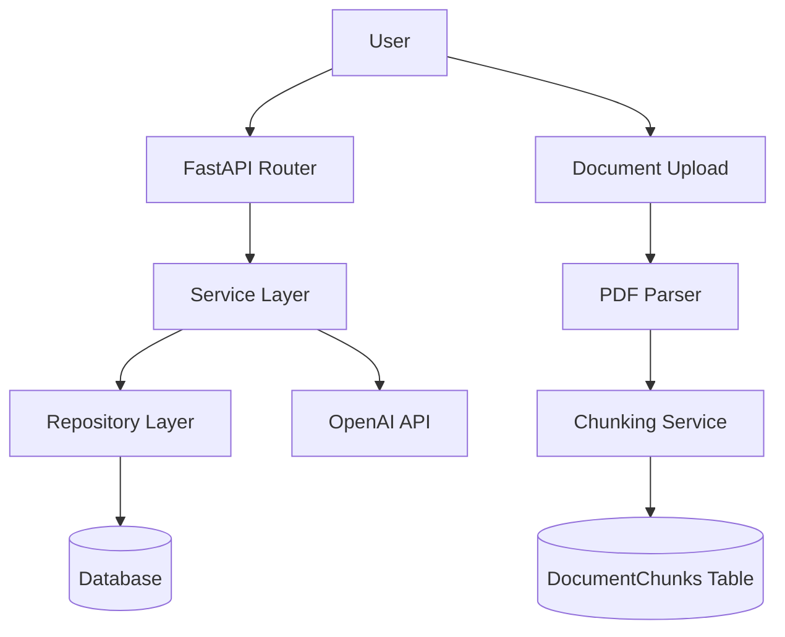

# DocOps AI

## Overview

LLM-powered document processing backend built with FastAPI.

This project is a backend system designed to process documents and enable AI-powered workflows such as document question answering, summarization, and report generation.

The system provides:

- LLM-based chat API
- conversation persistence
- document upload and processing pipeline
- structured document chunk storage

The architecture is designed to support **Retrieval-Augmented Generation (RAG)** workflows in future development.

---

## Project Goal

Many organizations handle large amounts of documents such as reports, specifications, and operational manuals.

However, extracting knowledge from these documents is time-consuming and inefficient.

DocOps AI aims to solve this problem by building an AI backend that can:

- ingest documents
- process and structure their contents
- enable LLM-powered querying and analysis

The long-term goal is to build a **document QA system powered by RAG**.

---

## Current Features

### LLM Chat API

- OpenAI API integration
- session-based conversation persistence
- message history windowing
- token usage tracking

### Conversation Storage

- Conversation and Message data model
- all user / assistant messages stored in database
- session-based chat continuity

### Document Upload Pipeline

- PDF upload API
- document metadata storage
- PDF text extraction
- automatic text chunking
- chunk storage in database

### Clean Backend Architecture

The system follows a layered architecture:

Router → Service → Repository → Database

This separation allows the system to scale and evolve toward more complex AI workflows.

---

## Tech Stack

### Backend

- Python 3.13
- FastAPI
- Uvicorn

### LLM

- OpenAI Python SDK

### Database

- SQLAlchemy 2.0
- SQLite

### Configuration

- pydantic-settings

### Document Processing

- PDF text extraction
- text chunking pipeline

---

## Architecture

The backend is designed using a layered architecture.

Request flow:

Router → Service → Repository → Database

### Architecture Diagram



### Router Layer

Responsibilities

- define API endpoints
- validate request and response schema
- delegate logic to services

Routers remain thin and avoid business logic.

---

### Service Layer

Responsibilities

- orchestrate application logic
- manage conversations
- construct LLM prompts
- call external services
- coordinate persistence

Examples

- chat_service
- document_service
- document_parser_service
- chunking_service

---

### Repository Layer

Responsibilities

- database CRUD operations
- SQLAlchemy query handling
- persistence abstraction

Repositories used in this project

- conversation_repo
- message_repo
- document_repo
- document_chunk_repo

---

## Document Processing Pipeline

Uploaded documents are processed through the following pipeline:

```
Upload Document
↓
Save PDF File (storage/documents)
↓
Store Document Metadata
↓
Extract Text from PDF
↓
Text Chunking
↓
Store Chunks in Database
↓
Document Status = processed
```

This pipeline prepares documents for **semantic retrieval and RAG workflows**.

---

## Data Model

### Conversation

Stores chat session metadata.

Fields

- session_id
- model
- created_at
- updated_at

---

### Message

Stores user and assistant messages.

Fields

- conversation_id
- role (user / assistant)
- content
- request_id
- model
- prompt_tokens
- completion_tokens
- total_tokens
- created_at

---

### Document

Stores uploaded document metadata.

Fields

- id
- filename
- stored_filename
- file_path
- status
- created_at

---

### DocumentChunk

Stores text chunks extracted from documents.

Fields

- document_id
- page_number
- chunk_index
- content

Document chunks are stored separately to enable future **embedding generation and semantic search**.

---

## Project Structure
```
docops-ai/
│
├── main.py
├── core/
│   └── settings.py
├── db/
│   └── base.py
│   └── session.py
│   └── init_db.py
├── dependencies/
│   └── db.py
├── models/ 
│   └── __init__.py
│   └── conversation.py
│   └── message.py
│   └── document.py
│   └── document_chunk.py
├── repositories/
│   └── conversation_repo.py
│   └── message_repo.py
│   └── document_repo.py  
│   └── document_chunk_repo.py
├── routers/
│   └── chat.py
│   └── documents.py
├── services/
│   └── chat_service.py
│   └── llm_service.py
│   └── document_service.py
│   └── document_parser_service.py
│   └── chunking_service.py
├── prompts/
│   └── system_prompt.py
│   └── prompt_builder.py
├── schemas/  
│   └── chat_schema.py
│   └── session_schema.py
│   └── document_schema.py
├── requirements.txt
├── .env
└── README.md
```

---

## API Endpoints

### Health Check

```
GET /health
```

Response

```json
{
  "status": "ok"
}
```

---

### Chat

```
POST /chat
```

Request

```json
{
  "message": "Hello",
  "session_id": null
}
```

If `session_id` is omitted or null, a new session is created.

Response

```json
{
  "reply": "Hello! How can I assist you today?",
  "request_id": "uuid",
  "session_id": "uuid",
  "usage": {
    "prompt_tokens": 8,
    "completion_tokens": 9,
    "total_tokens": 17
  }
}
```

Token usage is returned to support cost tracking.

---

### Upload Document

```
POST /documents/upload
```

Uploads a PDF document and processes it through the document pipeline.

Processing steps

- file storage
- metadata storage
- text extraction
- text chunking
- chunk database storage

---

## Local Setup

### 1. Clone Repository

```bash
git clone <repository-url>
cd docops-ai
```

---

### 2. Create Virtual Environment

```bash
python3 -m venv .venv
source .venv/bin/activate
```

---

### 3. Install Dependencies

```bash
pip install -r requirements.txt
```

---

### 4. Configure Environment Variables

Create `.env` file in project root:

```
OPENAI_API_KEY=your_api_key_here
MODEL_NAME=gpt-4o-mini
OPENAI_TIMEOUT_SEC=30
APP_ENV=local
DATABASE_URL=sqlite:///./app.db
```

---

## Run Server

```bash
python -m uvicorn main:app --reload
```

Swagger documentation:
```
http://127.0.0.1:8000/docs
```

---

## Current Implementation Status

Implemented

- FastAPI chat API
- OpenAI LLM integration
- conversation persistence
- message history windowing
- prompt builder layer
- document upload API
- PDF text extraction
- text chunking
- document chunk storage

---

## Roadmap

Next development steps

1. Generate embeddings for document chunks
2. Store embeddings in vector database
3. Implement semantic retrieval
4. Inject retrieved context into LLM prompts
5. Build document question answering API
6. Docker containerization
7. AWS deployment

---

## Notes
- `.env` file is ignored via `.gitignore`
- OpenAI API usage may incur costs
- Each request generates a unique `request_id`
- Token usage is tracked per request
- Document chunk storage is designed to support future embedding and retrieval systems