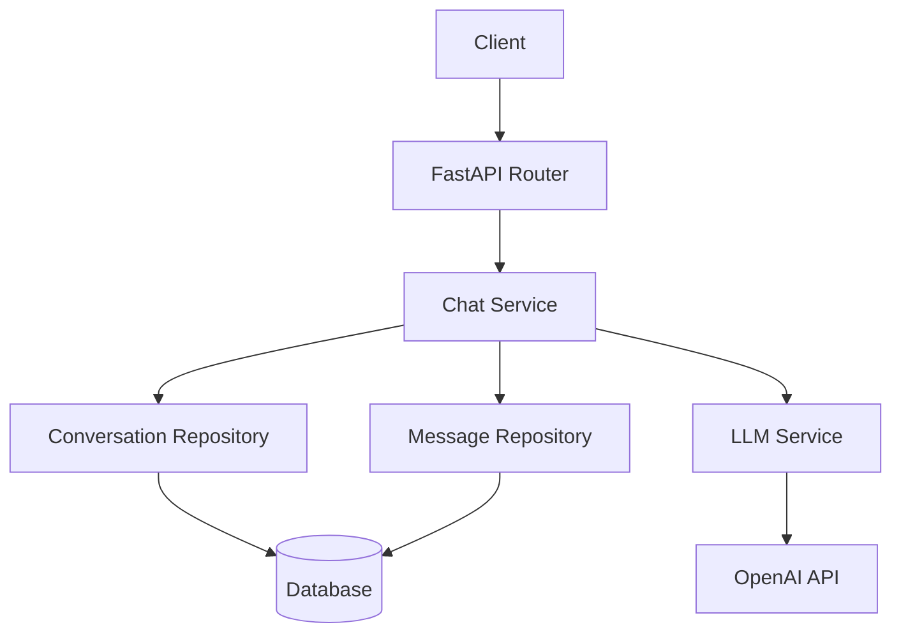

# System Architecture

## Overview

DocOps AI Agent is an LLM-based backend system designed to support document-driven AI workflows such as question answering, summarization, and report generation.

The backend is implemented using FastAPI and integrates with an external LLM provider (OpenAI) to enable conversational AI capabilities.

The system is designed using a layered architecture to clearly separate responsibilities between request handling, business logic, data persistence, and external AI services integration.

This architectural approach improves maintainability, testability, and scalability as the system evolves.

The current implementation focuses on the **LLM Chat Backend Core**, which provides conversation-based chat functionality with conversation persistence.

Future extensions will include document processing and Retrieval-Augmented Generation (RAG).

---

# High Level Architecture

The backend follows a layered architecture.

```
Client
→ FastAPI Router
→ Service Layer
→ Repository Layer
→ Database
```

External AI Integration is handled through a dedicated LLM service.

```
Chat Service
→ LLM Service
→ OpenAI API
```

Each layer has a clearly defined responsibility to maintain separation of concerns.

---

## Architecture Diagram



## Backend Layer Responsibilities

### Router Layer

The router layer handles HTTP requests and responses.

Responsibilities:

- Define API endpoints
- Validate request and response schemas
- Delegate business logic to the service layer

Routers should remain thin and contain minimal logic.

Example endpoint:

```
POST /chat
```

---

### Service Layer

The service layer contains the core application logic.

Responsibilities:

- Coordinate repositories and external services
- Manage conversation lifecycle
- Construct LLM message payload
- Handle chat workflow

Example responsibilities in `chat_service`:

- retrieve or create conversation
- store user message
- load recent conversation history
- construct LLM request
- call LLM service
- store assistant response

---

### Repository Layer

The repository layer is responsible for database interactions.

Responsibilities:

- Encapsulate database queries
- Provide persistence abstraction
- Keep service layer independent from ORM implementation

Repositories used in this project:

- `conversation_repo`
- `message_repo`

---

### Database Layer

The system uses:

- SQLite
- SQLAlchemy ORM

This layer manages persistent storage of conversations and messages.

---

## Conversation Data Model

The system separates conversation sessions and individual messages.

```
Conversation (1) → (N) Message
``` 

### Conversation

Represents a chat session.

Fields:

- session_id
- title
- model
- system_prompt
- created_at
- updated_at

---

### Message

Represents an individual interaction within a conversation.

Fields:

- conversation_id
- role (user / assistant)
- content
- request_id
- model
- token usage
- created_at

This design enables:

- multi-turn conversation support
- efficient message history retrieval
- conversation-level metadata management

---


## LLM Integration Architecture

The system isolates LLM interaction in a dedicated service.

```
Chat Service
→ LLM Service
→ OpenAI API
```

Benefits of this design:

- isolates external API dependencies
- simplifies testing
- allows easier replacement of model providers
- prepares the system for RAG integration

---

## Conversation Workflow (Simplified)

1. Client sends a request to `/chat`
2. Router forwards the request to `chat_service`
3. Service retrieves or creates a conversation
4. User message is stored in the database
5. Recent conversation history is retrieved
6. LLM request payload is constructed
7. `llm_service` calls the OpenAI API
8. Assistant response is stored
9. Response is returned to the client

---

## Project Directory Structure

```
docops-ai/

main.py

core/
settings.py

db/
base.py
session.py
init_db.py

dependencies/
db.py

models/
conversation.py
message.py

repositories/
conversation_repo.py
message_repo.py

routers/
chat.py

services/
chat_service.py
llm_service.py

schemas/
chat_schema.py
session_schema.py
```

---

## Future Architecture Extensions

The architecture is designed to suppport future expansion.

### Document Processing

- document upload API
- PDF parsing
- text chunking

### Retrieval-Augmented Generation (RAG)

- embedding generation
- vector database storage
- semantic retrieval
- context injection into prompts

### Infrastructure

- Docker containerization
- AWS EC2 deployment
- scalable backend services

---

## Design Principles

The system follows several architectural principles:

- separation of concerns
- layered architecture
- modular service design
- external API isolation

These principles help the system remain maintainable as the project grows.
