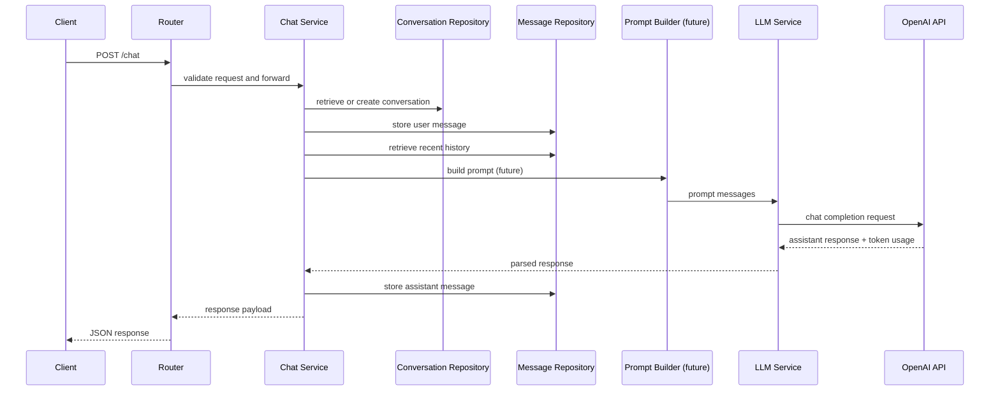

# Chat Request Flow

This document explains how the `/chat` API request flows through the system. 

The system follows a layered architecture:

Router → Service → Repository → Database

The LLM call is handled through a dedicated service layer.

---

## API Endpoint

`POST /chat`

The endpoint allows users to send a message and receive an AI response.

Request example

```json
{
    "message": "Explain the architecture",
    "session_id": "optional-session-id"
}
```

## High Level Flow

The following steps describe how a chat request is processed within the backend system.

The request lifecycle:

1. Client sends a request to `/chat`
2. Router validates request schema
3. Chat Service processes the request
4. Conversation is retrieved or created
5. User message is stored in the database
6. Conversation history is retrieved
7. LLM prompt is constructed
8. OpenAI API is called
9. Assistant response is stored
10. Response is returned to the client

---

## Detailed Flow

### 1. Router Layer

**File**
```
routers/chat.py
```

**Responsibilities**

- HTTP endpoint definition
- request validation
- dependency injection
- calling service layer

The router should contain minimal logic.

**Example**

`POST /chat`

The router forwards the request to `ChatService`.

---

### 2. Service Layer

**File**

```
services/chat_service.py
```

**Responsibilities**

- conversation management
- storing user messages
- retrieving conversation history
- constructing LLM messages
- calling LLM service
- storing assistant responses

This layer contains the main application logic.

---

### 3. Repository Layer

Repositories handle database access.

**Files**

```
repositories/conversation_repo.py
repositories/message_repo.py
```

**Responsibilities**

- database queries
- retrieving conversations
- storing messages
- retrieving message history

The repository layer keeps database logic separate from business logic.

---

### 4. Database Layer

The project uses:

- SQLite
- SQLAlchemy ORM

**Data Model**

Conversation

```
session_id
title
model
system_prompt
created_at
updated_at
```

Message

```
conversation_id
role
content
request_id
model
token usage
created_at
```

**Relationship**

```
Conversation 1 : N Message
```

--- 

## Conversation History

The system supports multi-turn conversations.

Recent messages are retrieved from the database and included in the prompt.

This allows the LLM to generate context-aware responses.

---

## LLM Request Generation

The LLM call is handled by a separate service.

```
chat_service → llm_service → OpenAI API
```

**Responsibilities of LLM service**

- prepare OpenAI request
- call OpenAI API
- return response and token usage

---

## Sequence Diagram



---

## Future Extension

The architecture is designed to support Retrieval-Augmented Generation (RAG).

Future flow:

```
Chat Service → Retrieval → Prompt Builder → LLM Service
```

This allows the system to inject document context into the LLM prompt.
